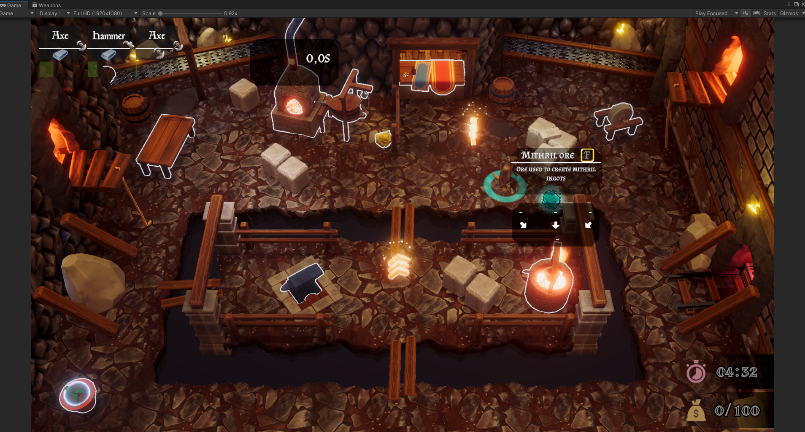
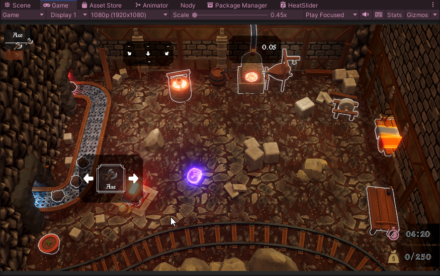

# Smithonia

Welcome to **Smithonia**, a unique and engaging game where animals collaborate in a forge to craft armor and weapons! Players work together to complete minigames at various workstations, aiming to produce high-quality items while navigating through increasingly complex levels. Dive into the exciting world of Smithonia and experience teamwork, creativity, and a dash of chaos.

---

## Features

- **Collaborative Crafting Gameplay**: Work as a team of animals managing a forge to craft armor and weapons.
- **Interactive Minigames**: Each workstation features unique minigames that require precision and skill. Properly completing these minigames rewards players with higher-quality items.
- **Challenging Levels**: Explore multiple levels with varying layouts and difficulty to keep gameplay fresh and exciting.
- **Magical Boxes**: Interact cautiously with good and evil magical boxes that can:
  - Trigger camera shifts.
  - Increase player speed.
  - Cause explosions that knock items out of players' hands.
- **Dynamic Gameplay Mechanics**: Balance time, skill, and teamwork to craft the best items possible.

---

## My Contributions

In the development of Smithonia, I contributed in the following areas:

1. **Level Design**: Designed and implemented levels with diverse layouts and increasing complexity.
2. **Gameplay Development**: Developed core mechanics, including minigames and workstation interactions.
3. **Bug Fixing**: Ensured smooth gameplay by resolving bugs and optimizing game performance.
4. **Game Design**: Contributed to conceptualizing and refining game mechanics and features.

---

## Images and Videos

We are currently working on showcasing Smithonia through engaging media! Screenshots and gameplay videos will be added soon to highlight the features, levels, and fun moments in the game. Stay tuned!

#### Level Design

#### Magical Boxes

#### Video Preview
<video controls src="Images/GameplayPreview.mp4" title="GameplayPreview"></video>
<video controls src="Images/AbilityBoxes.mp4" title="AbilityBoxes"></video>
<video controls src="Images/LevelDesign.mp4" title="LevelDesign"></video>

---

## Disclaimer

Please note that the **source code for Smithonia is not included in this repository**. As this is a collaborative endeavor and the project is still under development, the code can only be shared upon request. Feel free to reach out if you have questions or require specific details about the project.

---

## Getting Involved

We welcome feedback and suggestions! If you'd like to learn more about the development of Smithonia or share your thoughts, please don't hesitate to contact us.

---

Thank you for visiting the Smithonia repository! We hope you enjoy exploring our game as much as we enjoyed creating it.

